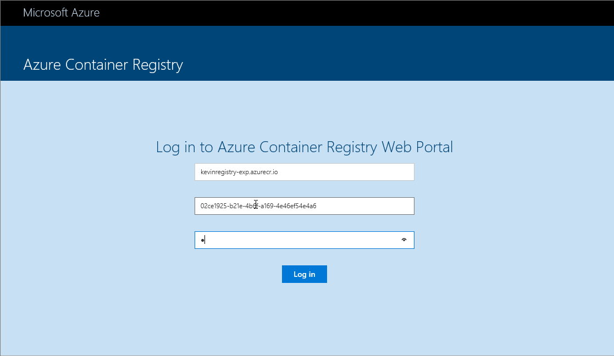

# Azure Container Registry Web Manager

The ACR Web Manager enables you to view metadata about your respositories and tags stored in your Azure Container Registry. You can find out more information about Azure Container Registry [here](https://azure.microsoft.com/services/container-registry).
 

## Running locally in Docker 

```bash
$ docker run -it -p 5000:80 azurecr/web-manager
```

## Build instructions

Make sure you have installed [dotnet core 3.0](https://dotnet.microsoft.com/download/dotnet-core/3.0)

```bash
$ cd src/WebManager/app
$ npm install
$ cd ..
$ dotnet restore
$ dotnet run
```

## Buiding and running the Docker image:

```bash
$ cd src/
$ docker build -t acrmanager -f WebManager/Dockerfile .
$ docker run -p 5000:80 -it --rm acrmanager
```


